# How to get the "play"-Button working on BDD feature files in IntelliJ

... when running the distribution via docker compose.

## what do you need?

- IntelliJ + Plugins:
    - Behat Support: https://plugins.jetbrains.com/plugin/7512-behat-support
    - Gherkin: https://plugins.jetbrains.com/plugin/9164-gherkin
- docker compose
- application must be up and running

## setup

### step 1 - docker compose PHP interpreter

First, you need to add a remote/docker PHP interpreter, it can be added via IntelliJ settings:

```
Settings | Languages & Frameworks | PHP
```

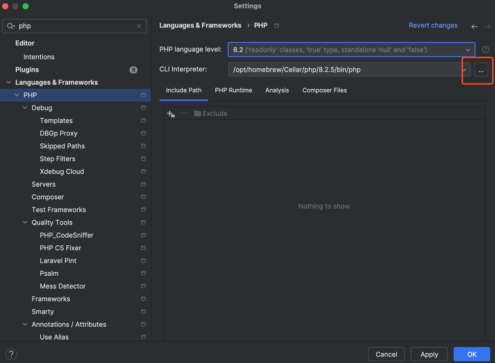

Add "From Docker, Vagrant, VM, WSL, Remote..."

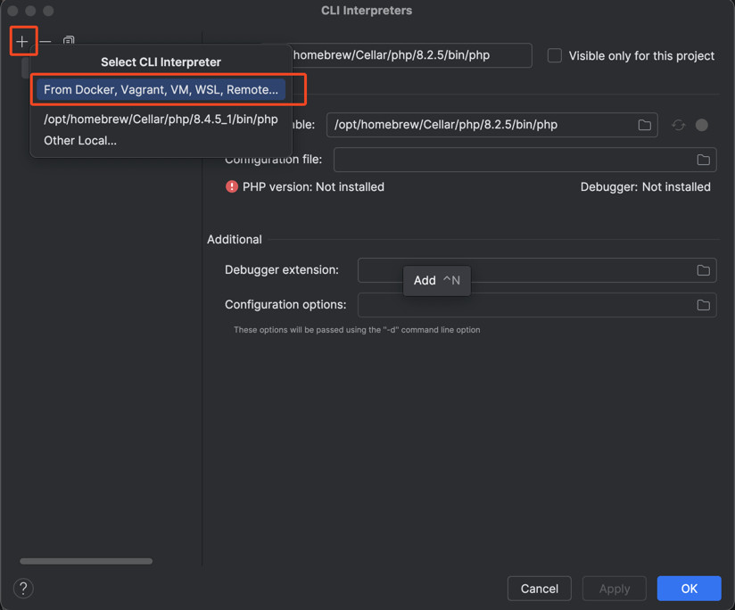

Now, choose "Docker Compose" and select the `neos` service. The [docker-compose.yml](../../docker-compose.yml) file for
local development (living in the project root) should be selected by default. If not, do so first.

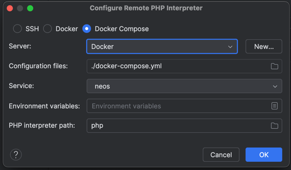

Change the Interpreter name to something meaningful and configure the Lifecycle
to **Connect to existing container**.

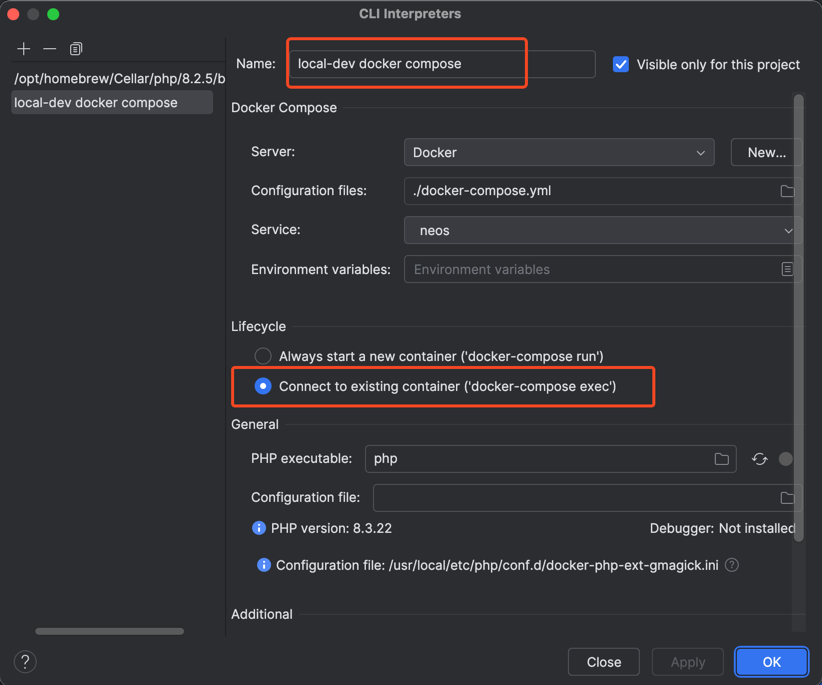

### step 2 - setup behat test runner for the created interpreter

Go to the Test Framework in the IntelliJ Settings:

```
Settings | Languages & Frameworks | PHP | Test Frameworks
```

Create a new **Behat by Remote Interpreter** configuration.

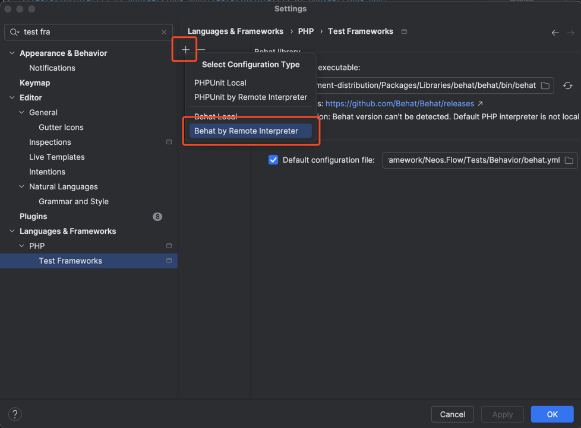

Now choose the Remote Interpreter you just created in step 1.

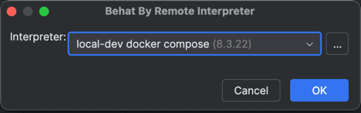

The behat Version should be detected after clicking "OK".

Change the **Executable Path** to `/app/Packages/Libraries/behat/behat/bin/behat`.

Change the **Default Configuration File** to
`/app/Packages/Neos/Neos.ContentRepository.BehavioralTests/Tests/Behavior/behat.yml.dist`.

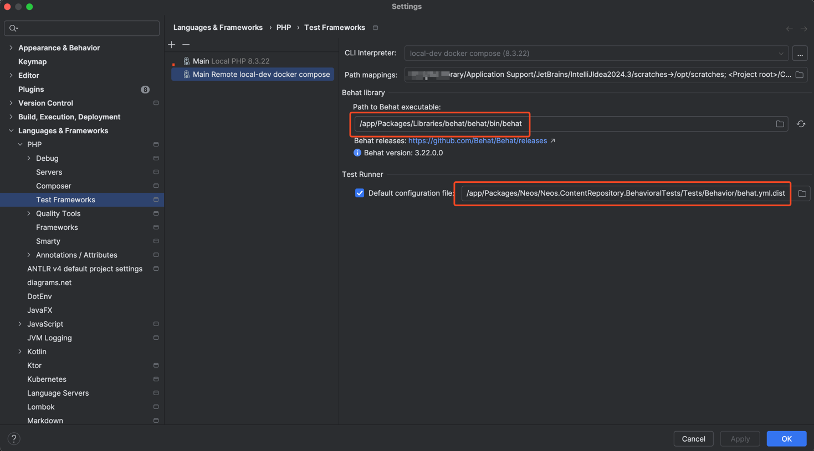

In case, you want to run tests from another package than `Neos.ContentRepository.BehavioralTests` you probably want to
set another config file.

### step 3 - configure your Behat run configuration template

Alternatively, you can declare the interpreter created in step 1 as default interpreter. Then you can skip this step.

HINT: In case, you pressed the play button before setting this up:

IntelliJ creates a fluent run-configuration each time you pressed the play button for a feature or scenario
for the first time. Since we are about to change the run-configuration **template**, you might want to **delete old 
run-configurations**. IntelliJ will re-use them once they are created and not "cycled out" of the list.

Go to your Run-Configurations and click "Edit configuration templates"

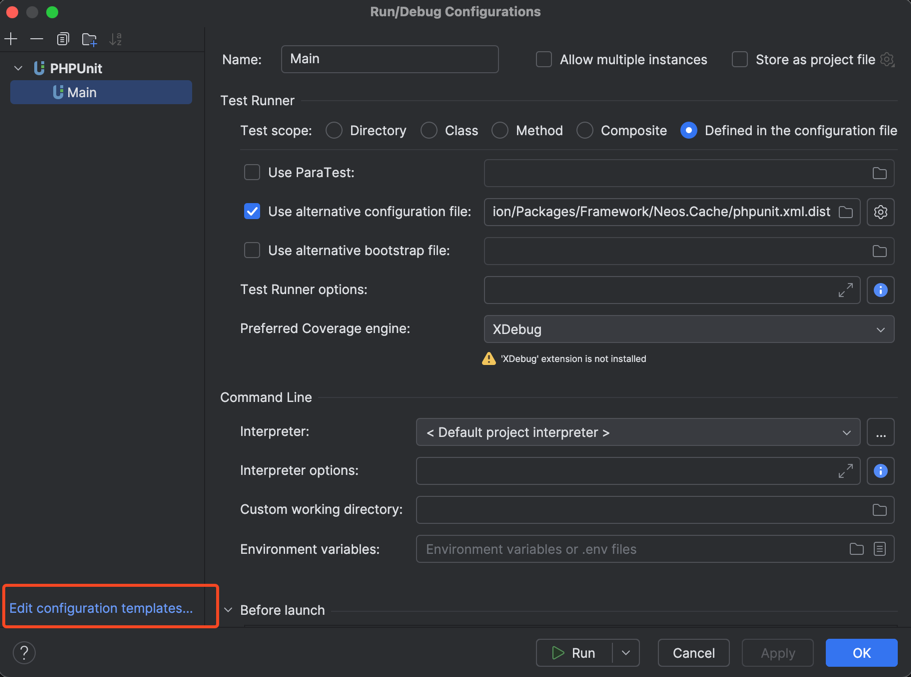

Now select "Behat" and change the default interpreter to your remote interpreter created in step 1.
 
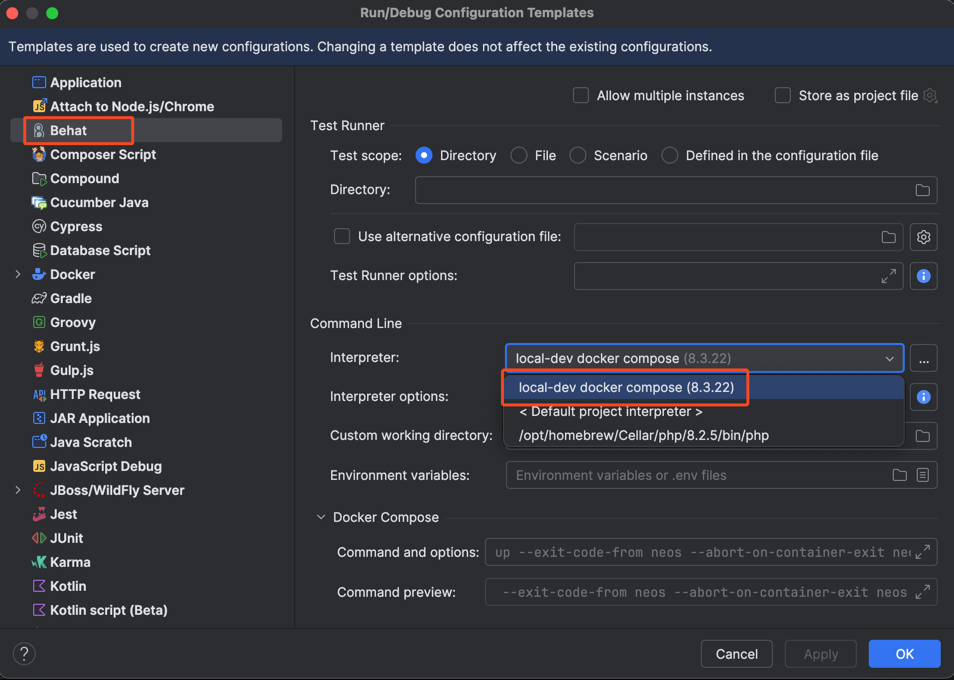

That should be it, now you are prepared to press play.

# Run BDD tests via play button

Running a single scenario should be possible now:

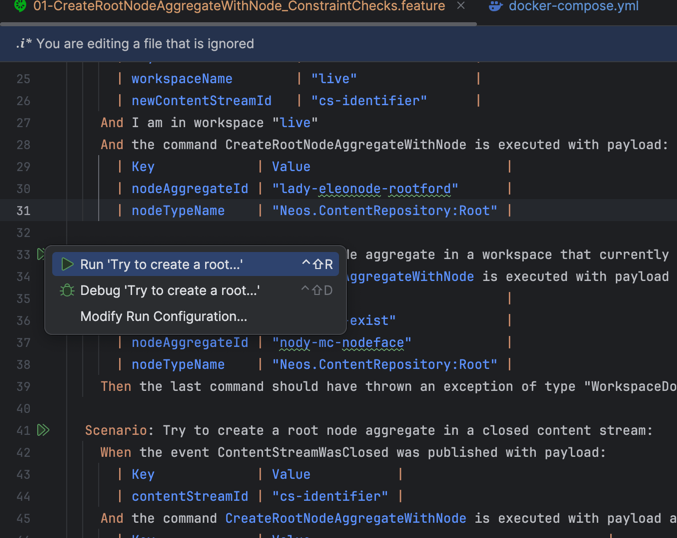

Results in:

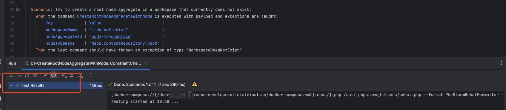

Also, you can run a whole feature by clicking play on the Feature line:

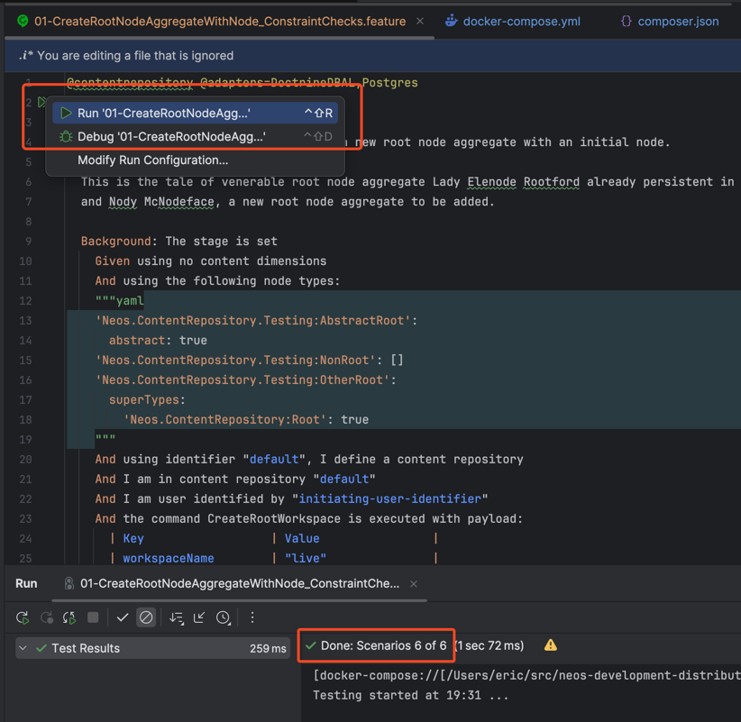

If you want to run a whole directory of feature files, right-click the directory, and choose
"Run ..." from the context menu:

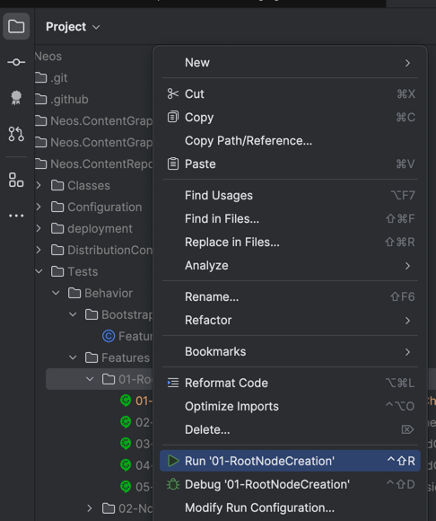

btw: Run all behat tests via command inside the docker container via:

```
/app/bin/behat -c /app/Packages/Neos/Neos.ContentRepository.BehavioralTests/Tests/Behavior/behat.yml.dist
```

Happy testing!
